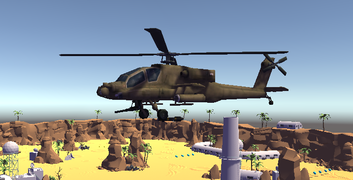

# Tank-Race

# Intro
Jeu de course de tank réalisé dans le cadre d'un cours de programmation Unity. Ce projet m'a servit à découvrir Unity et de m'améliorer avec ce moteur de jeu.

# But du jeu
C'est un jeu dans lequel le joueur pilote un tank. L'objectif est de réaliser trois tours de circuit en suivant les checkpoints répartis sur la carte et d'arriver avant le tank adverse. A chaque fois que le joueur fini cette course, son meilleur temps est sauvegardé.

# Interface

Lorsque le jeu est lancé, le joueur se retrouve sur le menu principal. Sur ce menu, il peut lancer une course, voir ses records, accéder au menu option ou quitter le jeu. Dans le menu dees records, son meilleur temps est affiché et dans le menu d'option il est possible de régler le volume général du jeu.

En jeu, le nombre de munition, de boosts et sa vitesse sont affiché en haut de l'écran. Les points de vie du joueur est représenté par le cercle autour du tank. Il changera de couleur en fontion du nombre de points de vie restant.

# Gameplay
Lorsque le joueur lance une course, un compte à rebours de trois seconde est lancé. Lorsque la course débute, le joueur peut contrôller le tank à l'aide des flèche du clavier. Il doit suivre les checkpoints qui s'illumine d'une lumière bleue. Pour aller à un checkpoint suivant, il est nécessaire de déclancher celui qui le précède. Il n'est donc pas possible de sauter des checkpoints. Cepentant, il n'y a pas d'itinéraire défini pour atteindre un checkpoint. Le joueur peut donc emprunter n'importe quel chemin pour l'atteindre.

Trois tourelles sont positionnées au nord de la carte et tireront des obus asser fréquament. Cela rend la course plus difficile pour le joueur. Si le joueur est touché, il perdra des points de vie. Si ses points de vie atteigne zéro, le joueur sera téléporté au dernier checkpoint qu'il a atteint.

Le joueur pourra collecter des bonus qui sont répartis sur le terrain au fil de sa course. Le tank dispose d'un inventaire dans lequel il peut stocker des munitions et des boosts.

Pour utiliser les boosts, le joueur peut appuyer sur la touche 'espace' pour augmenter sa vitesse pendant un bref moment. Pour utiliser les munitions, le joueur peut faire un click gauche pour lancer un obus. Si le click est maintenu, cela augmentera la puissance de l'obus et parcourra une plus grande distance. Pour l'instant, les munitions n'ont pas d'utilité dans le jeu.
Une fois trois tours complété par le joueur, le jeu s'arrête et affiche son chrono. Il lui sera ensuite proposé de recommencer la course ou de revenir sur le menu principal.

Et la meilleure feature du jeu est que le joueur peut klaxonner en appuyant sur la touche 'v'.

# Réalisation
J'ai réalisé ce projet à partir d'un tutoriel officiel Unity (Tanks Tutorial : https://unity3d.com/fr/learn/tutorials/s/tanks-tutorial)
Avec les outils que j'ai appris à maitriser au fil du tutoriel, j'ai tourné le jeu initial en un jeu de course. J'ai multiplié la taille de la carte par quatre pour faire une circuit asser long et je l'ai modifié pour pouvoir en faire un terrain de course avec les assets fourit par le tutoriel. 

# Amélioration
- Améliorer l'apparence et le flexibilité de l'UI.
- Donner un rôle à l'hélicoptère de combat pour rendre la course plus difficile.
- Rendre les contrôles du tank plus réaliste, plus fidèles aux contrôles d'un véhicule.
- Donner un rôle au tir d'obus par les tanks
- Rendre le tank adverse plus menaçant pour le joueur (barrer la route au joueur ou le priver de certains bonus, lui permettre d'untiliser les bonus ou lui accorder un pouvoir/capacité qui est propre au tank adverse).

# Illustration
La carte

